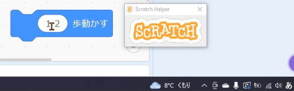

### Scratch Helper：Solve Scratch Japanese environment problem
## Scratchの日本語環境での問題を解決

## 概要
Scratchのブロックに数字を入力したとき、誤って全角で入力してしまうとScratchのコードが思ったように動作しません。この問題の解決を支援するアプリです。

1. 選択した文字列に全角文字が含まれているかチェックできます
2. 日本語入力モードでも強制的に半角数字が入力されるようになります

Scratchのプログラミングが終わったらアプリを閉じてください。

## デモ

## 環境
Microsoft Windows

## インストール方法
ダウンロードしたZIPファイルを好きな場所で解凍してください

## 使用方法
ScratchHelper.exeをダブルクリックしてください

1. IMEがONの状態でも数字は強制的に半角で入力されます。特に操作は必要ありません。

2. 文字列を選択して「無変換」キーと「c」を同時押しすると選択した文字列に全角文字が含まれるかどうかを判定して、結果をツールチップで表示します

## 作者
[ProgramNeko](https://github.com/programneko)

